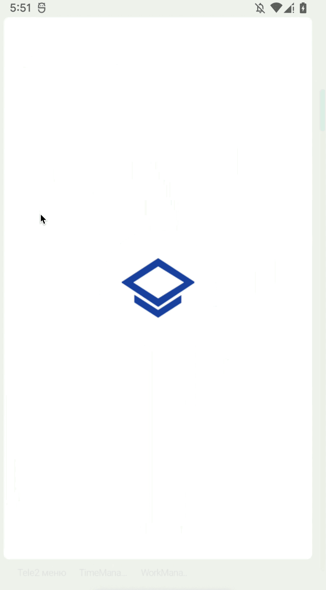

# Практикум по Navigation API

[Запись мастер-класса](https://youtu.be/2ftrSIbw5Cc)

[Проект-основа](https://github.com/Samsung-IT-Academy-MDev/3.8_practical_work)

Используя представленный в лекции пример, доработайте его следующим образом:

1. добавьте новый фрагмент с именем BlankFragment6
2. измените навигацию таким образом, чтобы кнопка button4 из BlankFragment3 осуществляла навигацию на BlankFragment
3. на отображаемом фрагменте должны присутствовать:
   - TextView с ID TextViewFragment6 и надписью Fragment6
   - Button с ID ButtonBack и надписью Back, которая осуществляет навигацию возврат по стеку.

## Демонстрация работы

|  |
| ----------------------- |

